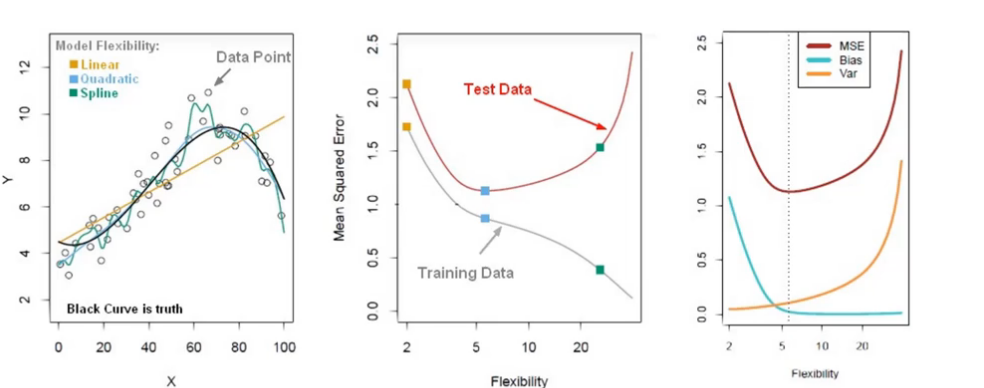

# Bias Variance Trade-off

Simple model vs Complex Model

Underfitting vs Overfitting

as the models gets more complex, the bias decreases and the variance increases, causing the model to overfit the data. This will make it to work better with the training data but not with the test data.

This can be seen visually by comparing the training and test errors.

in it we can see that as the model gets more complex we manage to reduce the error in both the training and test data but after a certain point the more complexity the model has the worse it performs with the test data.

